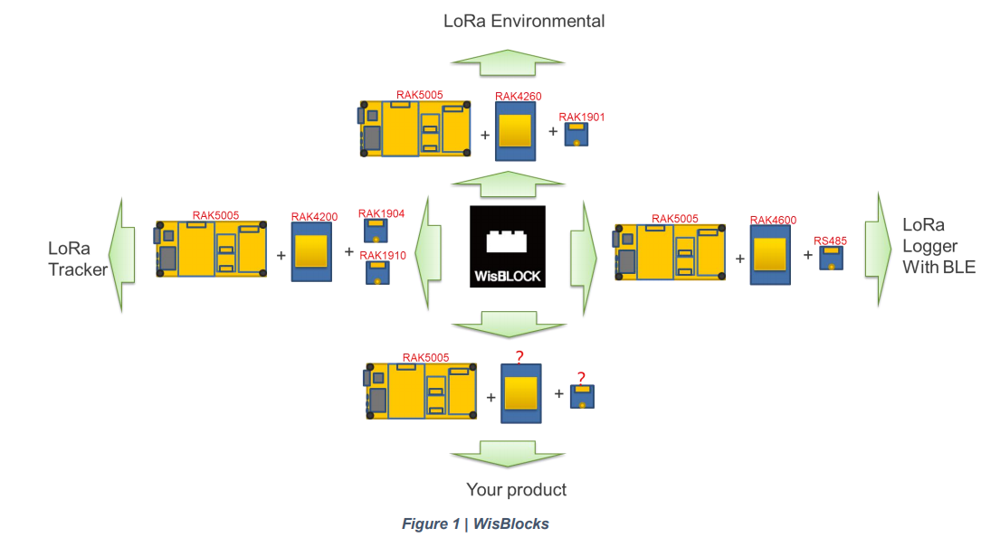

  [](https://github.com/RAKWireless/RAK-nRF52-Arduino/actions)

# Arduino Core for WisBlock Core RAK4631 and RAK4601 modules

This repository contains the Arduino BSP for WisBlock Core modules:
- [RAK4631](https://www.rakwireless.com)
- [RAK4601](https://www.rakwireless.com)

## What is WisBlock?
WisBlock is an amazing product built by the RAK company for IoT industry. It can build circuits like clicking blocks together to quickly to realize your idea. Checkout [Overview](#overview) for information or visit our [documentation center](https://docs.rakwireless.com/Product-Categories/WisBlock/)     

**RAKwireless invests time and resources providing this open source code, please support RAKwireless and open-source hardware by purchasing products from [RAKwireless](https://rakwireless.com)!**

**_For support and questions about RAKwireless products please visit our [forum](https://forum.rakwireless.com/)    
For examples and quick start tutorial please visit our [Github Repo](https://github.com/RAKWireless/Wisblock)    
For additional information about RAK products please visit our [Documentation Center](https://docs.rakwireless.com)    
To buy WisBlock modules please visit our [online store](https://store.rakwireless.com/)_**

----
## Content
- [Overview](#overview)     
  - [Description](#description)     
  - [Key Features](#key-features)     
  - [WisBlock Highlights](#wisblock-highlights)     

- [BSP Installation](#bsp-installation)    
  - [Stable Version](#stable-version)     
  - [Examples and Tutorials](#examples-and-tutorials)     
  - [Configuration](#configuration)     
----

## Overview

### Description

**WisBlock** is a modular system that makes it easy to implement a low power wide area network (LPWAN) into your IoT solution.
WisBlock is going with your solution from rapid prototyping to mass production without the need to create new hardware modules for each step.

- In the development phase, WisBlock modularity allows you to test different microcontrollers, sensors, communication technology, IO options by changing modules with the simple plug-in modules.
- WisBlock industrial-grade modules can be used in mass production without the need to redesign the prototypes.
- Even once deployed, devices can be modified or repaired with minimal waste and effort

### Key Features

**Click. Code. Connect.**

WisBlock is created with 4 modular blocks.
1. **WisBlock Base** is the baseboard that connects everything.
2. **WisBlock Core** is the computation and communication module
3. **WisBlock Sensor** is a selection of sensor and input modules
4. **WisBlock IO** extends the output and communication possibilities of the WisBlock Core

### WisBlock Highlights

- With the use of a compact connector, this makes its size exceptionally small. A WisBlock Base board, which is the base carrier, is only **30mm by 60mm** in size.
- Using an industrial rated connector, it enables you to use the same modules from rapid prototyping to testing to final product.  
- WisBlock is not only modular on the hardware base but with ready to use software blocks it is simple to create an application to match your solution requirements.

#### WisBlock Base

- WisBlock Base is the **carrier** for all WisBlock modules.
- It contains the power supply for all modules, **USB/5V connector**, **battery charger**, **solar charger**, **status LED**, and **reset button**.
- One WisBlock Base can hold one microcontroller module (WisBlock Core), one IO module (WisBlock IO), and up to 4 sensor modules (WisBlock Sensor).application to match your solution requirements.

#### WisBlock Core

- WisBlock Core is the **data processing center** of WisBlock.
- Some WisBlock Core modules also offer LoRa®/LoRaWan® communication and additional communication means like Bluetooth, Bluetooth Low Energy, or Wi-Fi.

#### WisBlock Sensor

- WisBlock Sensor is the **data acquisition module** of WisBlock.
- It includes analog, digital, and environmental as well as location acquisition sensors.

#### WisBlock IO

- WisBlock IO modules **extend the input and output possibilities** of WisBlock.
- Options include cellular, displays, LEDs, button interfaces, and additional USB and GPIO ports as well as Wi-Fi.

<center></center>  

## BSP Installation

### Stable Version

----
# ?? WARNING    
_**If you are using Windows 10**_.    
Do _**NOT**_ install the Arduino IDE from the Microsoft App Store. Please install the original Arduino IDE from the [Arduino official website](https://www.arduino.cc/en/Main/Software)!. The Arduino app from the Microsoft App Store has problems to use third party Board Support Packages.
:::

----
   

#### (1) [Download and install the Arduino IDE](https://www.arduino.cc/en/Main/Software) (At least v1.6.12)
#### (2) Follow [this guide](https://github.com/RAKWireless/RAKwireless-Arduino-BSP-Index) to install the required Board Support Package (BSP)    
----
### Examples and Tutorials
After you selected a RAK board you can see examples for all WisBlock modules
<center></center>     

For more information about the examples and tutorials visit our [Github WisBlock repo](https://github.com/RAKWireless/WisBlock)    

### Adafruit's nrfutil tools

[adafruit-nrfutil](https://github.com/adafruit/Adafruit_nRF52_nrfutil) (derived from Nordic pc-nrfutil) is needed to upload sketch via serial port.

- For Windows and macOS, pre-built executable binaries are included in the BSP at `tools/adafruit-nrfutil/`. It should work out of the box.
- Linux user need to run follow command to install it from PyPi

```
$ pip3 install adafruit-nrfutil --user
```

### Drivers

- [SiLabs CP2104 driver](https://www.silabs.com/products/development-tools/software/usb-to-uart-bridge-vcp-drivers) might be required for some modules.

<!---
# TODO Add bootloader support later
## Bootloader Support

### Upgrade existing Bootloader

Bluefruit's Bootloader is self-upgradable, you could upgrade to the latest Bootloader + Softdevice using the serial port within Arduino IDE.

- Select `Tools > Board > Adafruit Bluefruit Feather52`
- Select `Tools > Programmer > Bootloader DFU for Bluefruit nRF52`
- Select `Tools > Burn Bootloader`
- **WAIT** until the process complete ~30 seconds

**Note: close the Serial Monitor before you click "Burn Bootloader". Afterwards, you shouldn't close the Arduino IDE, unplug the Feather, launch Serial Monitor etc ... to abort the process. There is a high chance it will brick your device! Do this with care and caution.**

### Burning new Bootloader

To burn the bootloader from within the Arduino IDE, you will need the following tools installed
on your system and available in the system path:

- Segger [JLink Software and Documentation Pack](https://www.segger.com/downloads/jlink)
- Nordic [nRF5x Command Line Tools](https://www.nordicsemi.com/Software-and-Tools/Development-Tools/nRF-Command-Line-Tools)

Check to make sure you can run `nrfjprog` from your terminal/command prompt

**macOS Note** At present, you will need to create a symlink in `/usr/local/bin` to the
`nrfjprog` tool wherever you have added it. You can run the following command, for example:

```
$ ln -s $HOME/prog/nordic/nrfjprog/nrfjprog /usr/local/bin/nrfjprog
```

Once the tools above have been installed and added to your system path, from the Arduino IDE:

- Select `Tools > Board > Adafruit Bluefruit Feather52`
- Select `Tools > Programmer > J-Link for Feather52`
- Select `Tools > Burn Bootloader` with the board and J-Link connected

If you wish to modify bootloader to your own need, check out its repo here [Adafruit_nRF52_Bootloader](https://github.com/adafruit/Adafruit_nRF52_Bootloader)

#### Manually Burning the Bootloader via nrfjprog

The bootloader hex file can be found at `bin/bootloader` run the command as follows:

```
$ nrfjprog -e -f nrf52
$ nrfjprog --program feather_nrf52832_bootloader.hex -f nrf52
$ nrfjprog --reset -f nrf52
```
-->

-----
# Credits

This BSP is based on [Adafruits nRF52 BSP](https://github.com/adafruit/Adafruit_nRF52_Arduino),    
which is based on [Arduino-nRF5](https://github.com/sandeepmistry/arduino-nRF5) by Sandeep Mistry,    
which in turn is based on the [Arduino SAMD Core](https://github.com/arduino/ArduinoCore-samd).

The following libraries are used:

- adafruit-nrfutil is based on Nordic Semiconductor ASA's [pc-nrfutil](https://github.com/NordicSemiconductor/pc-nrfutil)
- [freeRTOS](https://www.freertos.org/) as operating system
- [tinyusb](https://github.com/hathach/tinyusb) as usb stack
- [nrfx](https://github.com/NordicSemiconductor/nrfx) for peripherals driver
- [littlefs](https://github.com/ARMmbed/littlefs) for internal file system
